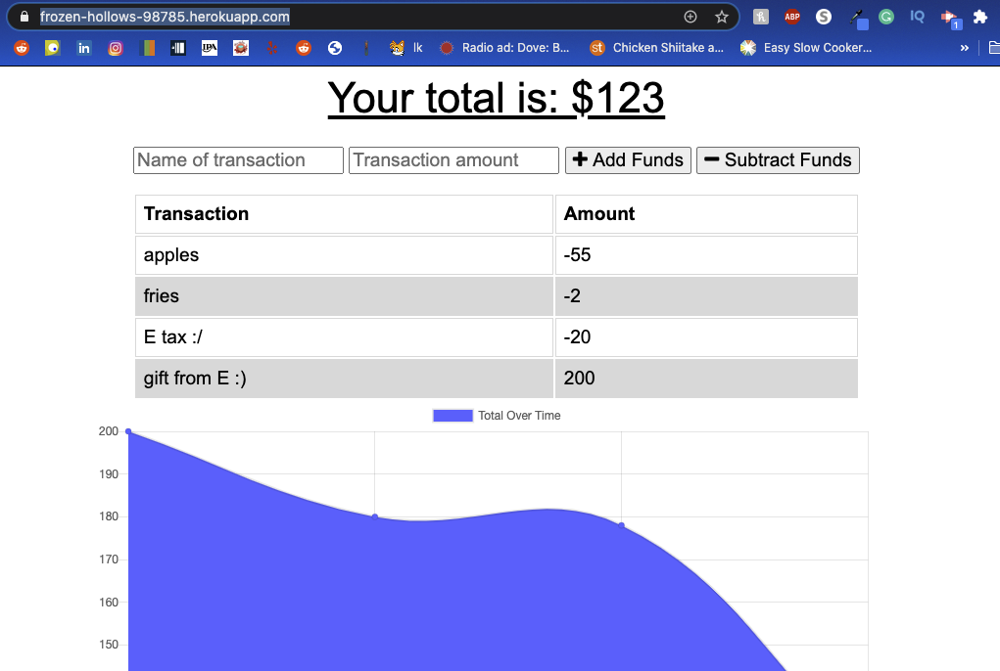

# Budget Tracker

## Table of Contents
* [Description](#Description)
* [Installation Instruction](#Installation-Instructions)
* [Usage Information](#Usage-Information)
* [Contributions](#Contributions)
* [Testing](#Testing)
* [Questions?](#Questions?)
## Description
This is a progressive web application that allows a user to track their budget whether on or offline. Necessary files are cached to be used when offline and transactions made offline are updated as soon as the user is back online.
## Installation Instructions
Download all necessary files and run npm install to install all dependencies are in package.json. Otherwise just use the deployed heroku app.
## Usage Information
Name transactions and enter an amount, then click either the add or subtract funds button to log the event to the database. A graphic of your budget will appear below. If you are offline (or select offline mode from the dev tools), the budget will still track your transactions, and will update the database when you are back online.
## Contributions
Much thanks to Elijah Flanders for working on this project with me.
## Testing
N/A
## Questions?
Contact the author for further inquiries! 
Deployed link: (https://frozen-hollows-98785.herokuapp.com/) 
Github link: (https://github.com/kyliemegan24) 
Email: kyliemegan24@gmail.com
